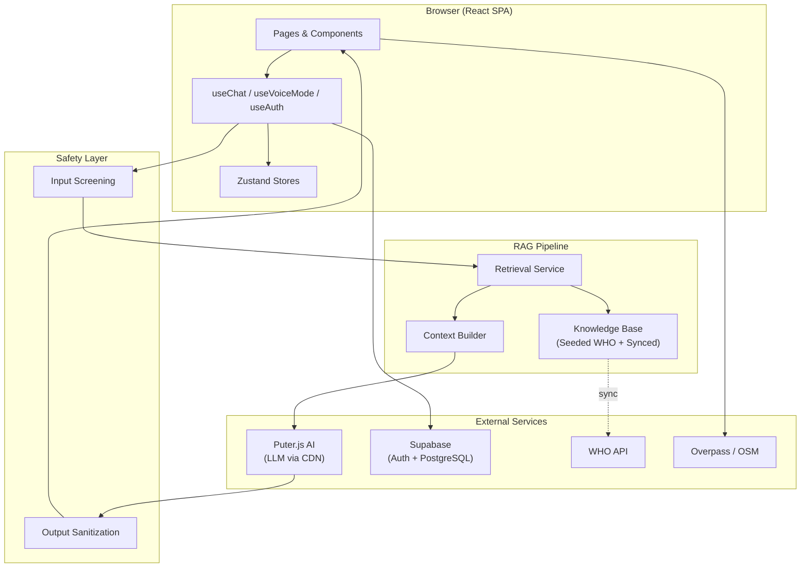

<div align="center">

# HealthWise AI

**AI-Driven Public Health Chatbot for Disease Awareness**

An educational health information system that combines retrieval-augmented generation with WHO-sourced evidence to provide trustworthy, accessible public health guidance.

[](https://www.typescriptlang.org/)
[](https://react.dev/)
[](https://vitejs.dev/)
[](https://supabase.com/)
[](https://tailwindcss.com/)

[Live Demo](#deployment) · [Getting Started](#getting-started) · [Architecture](#architecture)

</div>

---

## Overview

HealthWise AI is a web application that helps users learn about diseases, understand health reports, and find nearby medical facilities — all powered by AI grounded in evidence from the World Health Organization and other trusted public health authorities.

The system uses a **Retrieval-Augmented Generation (RAG)** pipeline to ensure AI responses are backed by indexed WHO factsheets rather than unverified model knowledge. A dedicated **safety layer** screens every query for emergencies, blocks prompt injection, and prevents the AI from making diagnostic or prescriptive claims.

> **Important:** HealthWise AI is strictly an educational and public health awareness tool. It does **not** provide medical diagnoses, prescribe treatments, or replace qualified healthcare professionals. Users experiencing emergencies should contact emergency services immediately.

---

## Why HealthWise AI?

Health misinformation is a growing global challenge. General-purpose chatbots can hallucinate medical facts, lack source attribution, and provide dangerous advice without safeguards.

HealthWise AI addresses this by:

- **Grounding every response** in a curated knowledge base of WHO factsheets and verified health documents
- **Refusing to diagnose or prescribe** — the safety layer rewrites diagnostic language and appends mandatory disclaimers
- **Detecting emergencies** — red-flag symptoms trigger immediate escalation banners with emergency hotline numbers
- **Supporting underserved languages** — UI translations in English, Hindi, and Telugu with AI-assisted dynamic translation for additional languages

---

## Features

### AI Health Assistant
- Natural-language health Q&A with context-aware follow-up
- Retrieval-augmented generation using indexed WHO factsheets
- Evidence-grounded responses with source citations and links
- Suggested starter questions for common health topics
- Conversation history with session management
- Floating assistant widget available on every page
- Thumbs up/down feedback collection per response

### Medical Safety System
- **Emergency detection** — regex-based screening for cardiac, stroke, suicide/self-harm, poisoning, choking, and severe trauma keywords
- **Prompt injection protection** — pattern detection for jailbreak attempts, role overrides, and instruction injection
- **Diagnostic claim prevention** — output post-processing rewrites phrases like "you have" → "may be associated with"
- **Prescription blocking** — refuses to recommend specific medications or dosages
- **Mandatory disclaimers** — every AI response includes a non-diagnostic notice
- **Safety event logging** — all safety triggers are recorded with severity classification
- **Emergency hotline directory** — global emergency numbers (112, 911, 988, NHS 111) with click-to-dial

### Disease Explorer
- Searchable directory of 10 major diseases (Dengue, Diabetes, Malaria, Hypertension, Asthma, TB, Depression, Cholera, Measles, Typhoid)
- Category filtering (Communicable, Non-Communicable, Tropical, Respiratory, Mental Health)
- Individual disease guides with symptoms, prevention, risk factors, and warning signs
- Bookmark support for saving disease guides
- Direct link to ask the AI about any disease

### Health Report Explainer
- Upload PDF, JPG, or PNG lab reports (up to 10 MB)
- File validation with magic byte verification to prevent spoofing
- Text extraction via `pdfjs-dist` with tabular row reconstruction
- Deterministic parsing of known lab tests (Hemoglobin, Glucose, SGPT, Creatinine, etc.) with reference range comparison
- Clinical pattern detection (e.g., Microcytic Anemia, Glycemic patterns)
- AI-generated plain-language explanation with doctor-ready follow-up questions
- Medical attention level classification (Routine / Soon / Urgent)
- Nearby healthcare facility map integration
- **Session-only processing** — no reports are persisted; data is discarded on page leave

### Healthcare Locator
- Browser geolocation with user consent
- OpenStreetMap data via Overpass API (no Google Maps dependency)
- MapLibre GL interactive map with facility markers
- Searches for hospitals, clinics, pharmacies, doctors, and dentists
- Haversine distance calculation with distance-based sorting
- Manual city/area search via Nominatim geocoding
- Spatial deduplication (150m proximity threshold)

### Voice Mode
- Speech-to-text via Web Speech API (`SpeechRecognition` / `webkitSpeechRecognition`)
- Text-to-speech via `SpeechSynthesis` for AI response readback
- Continuous listening with interim transcript display
- Mobile-aware result accumulation (handles Android Chrome's per-word `isFinal` behavior)
- Barge-in / interruption support — speak to interrupt AI responses
- Supports English, Hindi, and Telugu voice recognition
- ChatGPT-style voice loop: Listen → Think → Speak → Listen

### Multilingual Support
- **Tier 1 (Verified UI translations):** English, Hindi (हिन्दी), Telugu (తెలుగు)
- **Tier 2 (AI-assisted dynamic translation):** Tamil, Bengali, Kannada, Malayalam, Marathi, Gujarati, Punjabi, Urdu, Odia, Spanish, French, German, Arabic, Portuguese, Russian, Japanese, Korean, Chinese
- Runtime language switching with localStorage persistence
- Translation caching (up to 400 items) to reduce redundant AI calls

### Authentication & User Features
- Supabase email/password authentication
- Automatic profile creation on signup (via PostgreSQL trigger)
- Role-based access control (User / Admin)
- Offline sandbox mode when Supabase is not configured
- User dashboard with conversation and bookmark metrics
- Chat history with session search and resume
- Bookmarks for diseases, documents, and external resources
- Profile management with language preference and account deletion

### Admin Portal
- **Dashboard** — aggregate metrics (indexed documents, verified sources, pending reviews, safety triggers)
- **Knowledge Base** — browse indexed chunks and manage corpus synchronization
- **Sources** — manage public health authority source feeds (WHO, CDC, MoHFW)
- **Content Review** — editorial audit queue for flagged content
- **Analytics** — usage metrics, query categories, language frequency
- **Feedback** — thumbs up/down log with query references
- **Safety Logs** — triage alert audit trail with severity classification
- **Settings** — AI model selection (GPT-4o-mini, Claude, DeepSeek) and mock AI toggle

### Responsive & PWA
- Responsive layout from 320px mobile to 4K desktop
- Fixed mobile bottom navigation with safe-area support
- Web App Manifest for "Add to Home Screen" installation
- Code-split routes with lazy loading (React.lazy + Suspense)
- Manual chunk optimization for vendor libraries (React, Supabase, PDF, MapLibre, Icons)

---

## How It Works

```
User Input (Text or Voice)
        │
        ▼
┌─────────────────────┐
│   Safety Screening   │  ← Emergency detection, prompt injection filtering
└─────────┬───────────┘
          │
          ▼
┌─────────────────────┐
│  Query Preprocessing │  ← Entity extraction, intent detection, multi-turn expansion
└─────────┬───────────┘
          │
          ▼
┌─────────────────────┐
│   RAG Retrieval      │  ← Score all indexed chunks by topic + intent + lexical overlap
└─────────┬───────────┘
          │
          ▼
┌─────────────────────┐
│  Context Builder     │  ← Format top-K evidence chunks with citations
└─────────┬───────────┘
          │
          ▼
┌─────────────────────┐
│   Puter.js AI        │  ← Generate response within strict safety system prompt
└─────────┬───────────┘
          │
          ▼
┌─────────────────────┐
│  Output Sanitization │  ← Rewrite diagnostic claims, append disclaimer
└─────────┬───────────┘
          │
          ▼
   Response with Sources
```

---

## AI & RAG Architecture

The retrieval pipeline operates entirely on the client side using in-memory chunk scoring:

1. **Query Preprocessing** — Extracts health entities (Dengue, Diabetes, etc.) and intents (symptoms, prevention, treatment, causes, vaccination) from the user query and recent conversation history
2. **Chunk Scoring** — Every indexed knowledge chunk is scored using a weighted combination of:
   - Topic match (does the chunk's topic align with extracted entities?)
   - Intent match (does the chunk's heading/content match the detected intent?)
   - Lexical token overlap (BM25-style term frequency scoring)
3. **Threshold Filtering** — Chunks below a configurable minimum relevance score (default: 0.25) are discarded
4. **Top-K Selection** — The highest-scoring chunks (default: 4) are selected
5. **Context Construction** — Selected chunks are formatted into an evidence block with source attribution rules
6. **AI Generation** — The evidence block is injected into a strict system prompt that instructs the model to synthesize only from the provided evidence, never invent facts, and always cite sources
7. **Output Safety** — Post-processing rewrites diagnostic language and appends the medical disclaimer
8. **Caching** — Results are cached in a TTL-based in-memory cache to avoid redundant processing

The knowledge base includes pre-indexed WHO factsheets (seeded offline) and can be supplemented by syncing from the WHO API (`https://www.who.int/api/hubs/factsheets`).

> **Note:** The retrieval is lexical/topic-based scoring, not vector embedding similarity. The database schema includes a `vector(384)` column and pgvector extension for future embedding-based retrieval, but the current client-side retrieval service uses deterministic scoring.

---

## Trusted Health Information

```
WHO API (factsheets)  ──►  Knowledge Service  ──►  Document chunking
                                                        │
Seeded WHO factsheets  ─────────────────────────────────┘
(Dengue, Diabetes, Malaria,                              │
 Hypertension, Asthma, TB,                               ▼
 Depression, Cholera, Measles,               Indexed Knowledge Chunks
 Typhoid)                                    (topic, heading, content)
                                                        │
                                                        ▼
                                              Retrieval Service
                                           (scoring + threshold)
                                                        │
                                                        ▼
                                              Context Builder
                                            (evidence + rules)
                                                        │
                                                        ▼
                                                  AI Response
                                           (grounded in evidence)
```

The AI is explicitly instructed:
- Synthesize **only** from retrieved evidence
- Never invent symptoms, treatments, or statistics
- Always cite the source document
- Refuse requests outside its health education scope

---

## Architecture



---

## Tech Stack

| Layer | Technology | Version |
|-------|-----------|---------|
| **UI Framework** | React | 18.3 |
| **Language** | TypeScript | 5.6 |
| **Build Tool** | Vite | 6.0 |
| **Styling** | Tailwind CSS | 3.4 |
| **Routing** | React Router DOM | 6.28 |
| **State Management** | Zustand | 5.0 |
| **Icons** | Lucide React | 1.16 |
| **AI Provider** | Puter.js (CDN) | v2 |
| **Database & Auth** | Supabase (PostgreSQL) | 2.116 |
| **Maps** | MapLibre GL | 6.10 |
| **Geocoding & POI** | Overpass API / Nominatim (OpenStreetMap) | — |
| **PDF Processing** | pdfjs-dist | 3.11 |
| **Voice** | Web Speech API (browser-native) | — |
| **CSS Utilities** | clsx, tailwind-merge | 2.1, 2.5 |
| **PWA** | Web App Manifest | — |

---

## Database

The application uses Supabase PostgreSQL with 15 tables, full Row Level Security, and an admin privilege system via a `SECURITY DEFINER` function.

| Table | Purpose |
|-------|---------|
| `profiles` | User profiles linked to `auth.users`, with role (user/admin) and language preference |
| `knowledge_sources` | Registered health authorities (WHO, CDC, MoHFW) with trust tiers |
| `knowledge_documents` | Parent documents ingested from sources, with lifecycle status |
| `knowledge_chunks` | Semantic text chunks for RAG retrieval, with FTS tsvector index |
| `diseases` | Disease directory entries (symptoms, prevention, warning signs as JSONB) |
| `health_topics` | General health topic articles |
| `chat_sessions` | User conversation sessions |
| `chat_messages` | Individual messages with sender, intent, urgency level, and source citations |
| `bookmarks` | User-saved diseases, documents, and external resources |
| `feedback` | Thumbs up/down ratings linked to specific messages |
| `analytics_events` | Privacy-conscious usage events (no PII) |
| `safety_events` | Red-flag trigger audit trail with severity and action taken |
| `content_reviews` | Editorial review lifecycle records |
| `app_settings` | Application configuration key-value store |
| `supported_languages` | Active language registry (en, te, hi) |

**Row Level Security** is enforced on every table:
- Users can only access their own profiles, sessions, messages, bookmarks, and feedback
- Public health content (diseases, topics, sources, published documents) is publicly readable
- Admin operations are gated through `public.is_admin()` — a `SECURITY DEFINER` function that checks the `profiles.role` column

**Additional database features:**
- pgvector extension (`vector(384)` column + IVFFlat index) — provisioned for future embedding-based retrieval
- Full-text search via `tsvector` generated column on `knowledge_chunks`
- Stored function `match_knowledge_chunks()` for server-side FTS retrieval
- Automatic profile creation trigger on `auth.users` insert

---

## Project Structure

```
healthwise-ai/
├── public/
│   ├── favicon.svg
│   └── manifest.json
├── src/
│   ├── components/
│   │   ├── chat/              # AIAvatar, FloatingHealthWiseAI, VoiceModeModal
│   │   ├── common/            # Button, Card, Badge, EmergencyBanner, ProtectedRoute, SkipLink
│   │   ├── healthcare/        # NearbyHealthcarePanel (MapLibre + Overpass)
│   │   ├── landing/           # HeroSection, Capabilities, Topics, HowItWorks, FAQ, etc.
│   │   ├── layout/            # MainLayout, Header, Footer, MobileNav
│   │   └── report/            # ReportUploadCard, ReportResultsView
│   ├── hooks/                 # useAuth, useBookmarks, useChat, useTranslation, useVoiceMode
│   ├── pages/
│   │   ├── admin/             # AdminDashboard, KnowledgeBase, Sources, Reviews, Analytics, etc.
│   │   ├── ChatPage.tsx       # Core AI conversation interface
│   │   ├── ReportExplainerPage.tsx
│   │   ├── DiseasesPage.tsx / DiseaseDetailPage.tsx
│   │   └── ...                # Home, Resources, Prevention, Vaccination, Profile, etc.
│   ├── services/
│   │   ├── ai/                # puter-ai-service (RAG orchestration + LLM calls)
│   │   ├── auth/              # auth-service (Supabase Auth + mock fallback)
│   │   ├── chat/              # chat-service (session + message persistence)
│   │   ├── database/          # supabase-client initialization
│   │   ├── diseases/          # disease-service (directory of 10 diseases)
│   │   ├── i18n/              # i18n-service, language-registry, translations, translation-service
│   │   ├── knowledge/         # knowledge-service, retrieval-service, context-builder, who-api-service, chunking-service, seeded-knowledge
│   │   ├── location/          # healthcare-finder-service (Overpass + Nominatim)
│   │   ├── report/            # report-extractor, report-parser, report-ai, report-validator
│   │   ├── resources/         # resource-service (8 curated health organizations)
│   │   ├── safety/            # safety-service (emergency detection + output sanitization)
│   │   ├── security/          # sanitizer (XSS, URL validation, PII masking)
│   │   └── voice/             # voice-service (Web Speech API wrapper)
│   ├── stores/                # auth-store, chat-store (Zustand)
│   ├── types/                 # TypeScript interfaces (auth, chat, database, rag, report)
│   └── utils/                 # cache (TTL-based in-memory cache)
├── supabase/
│   └── migrations/            # 001_initial_schema, 002_knowledge_base_sync, 002_fix_profiles_rls, 003_vector_rag_retrieval
├── docs/                      # ARCHITECTURE.md, DATABASE.md, DEPLOYMENT.md, TESTING.md
├── .env.example
├── index.html
├── package.json
├── tailwind.config.js
├── tsconfig.json
└── vite.config.ts
```

---

## Getting Started

### Prerequisites

- **Node.js** ≥ 18
- **npm** ≥ 9
- A **Supabase** project (optional — the app runs in sandbox mode without it)

### Installation

```bash
git clone https://github.com/yourusername/healthwise-ai.git
cd healthwise-ai
npm install
```

### Environment Configuration

```bash
cp .env.example .env
```

Edit `.env` with your values:

```env
# AI Configuration (Puter.js — no API keys needed for basic usage)
VITE_PUTER_AI_MODEL=gpt-4o-mini
VITE_ENABLE_MOCK_AI=false

# Supabase (optional — omit for sandbox mode)
VITE_SUPABASE_URL=https://your-project-id.supabase.co
VITE_SUPABASE_ANON_KEY=your-anon-public-key-here

# Application
VITE_APP_NAME="HealthWise AI"
VITE_APP_ENV=development
VITE_DEFAULT_LANGUAGE=en
```

> **Security:** Never commit `.env` or expose the Supabase service-role key in client code. Only the anon (public) key is used.

### Development

```bash
npm run dev
```

The app starts at `http://localhost:5173`.

### Production Build

```bash
npm run build    # TypeScript check + Vite build → dist/
npm run preview  # Serve the built version locally
```

---

## Database Setup

If using Supabase, apply the migrations in order:

1. `supabase/migrations/001_initial_schema.sql` — Creates all 15 tables, RLS policies, admin function, and profile trigger
2. `supabase/migrations/002_knowledge_base_sync.sql` — Knowledge base sync enhancements
3. `supabase/migrations/002_fix_profiles_rls.sql` — Profiles RLS policy fix
4. `supabase/migrations/003_vector_rag_retrieval.sql` — pgvector extension, embedding column, FTS tsvector, and `match_knowledge_chunks()` function

Apply via the Supabase SQL Editor or CLI:
```bash
supabase db push
```

Without Supabase, the app automatically falls back to localStorage-based persistence with mock authentication.

---

## Environment Variables

| Variable | Required | Description |
|----------|----------|-------------|
| `VITE_PUTER_AI_MODEL` | No | AI model name for Puter.js (default: `gpt-4o-mini`) |
| `VITE_ENABLE_MOCK_AI` | No | Set `true` to use deterministic mock responses instead of AI |
| `VITE_SUPABASE_URL` | No | Supabase project URL. Omit for sandbox mode |
| `VITE_SUPABASE_ANON_KEY` | No | Supabase anon/public key. Omit for sandbox mode |
| `VITE_APP_NAME` | No | Application display name |
| `VITE_APP_ENV` | No | `development` or `production` |
| `VITE_DEFAULT_LANGUAGE` | No | Default UI language code (`en`, `hi`, `te`) |

---

## Verification Status

| Check | Result |
|-------|--------|
| TypeScript (`tsc --noEmit`) | ✅ Pass — 0 errors |
| Production Build (`npm run build`) | ✅ Pass — 2,025 modules transformed |
| Output | 39 optimized chunks in `dist/` |
| Total CSS | 142.18 kB (2 files) |
| Total JS | ~2.3 MB uncompressed / ~650 kB gzipped |

---

## Deployment

Deploy the `dist/` folder to any static hosting provider that supports SPA routing:

**Vercel:**
- Connect the GitHub repository
- Build command: `npm run build`
- Output directory: `dist`
- Add environment variables in project settings
- Configure SPA fallback: rewrite all routes to `/index.html`

**Netlify / Cloudflare Pages:**
- Same build command and output directory
- Add `_redirects` file: `/* /index.html 200`

---

## Security

| Protection | Implementation |
|-----------|---------------|
| **Authentication** | Supabase Auth with email/password; automatic profile creation |
| **Authorization** | Row Level Security on all 15 tables; `is_admin()` SECURITY DEFINER function |
| **XSS Prevention** | HTML entity escaping via `sanitizer.ts`; `nosniff` and strict referrer headers in `index.html` |
| **Prompt Injection** | Regex detection of jailbreak patterns, role overrides, and instruction injection |
| **PII Masking** | Redaction of emails, phone numbers, and ID patterns before logging |
| **URL Validation** | Protocol whitelist (http/https only); no `javascript:` or `data:` URIs |
| **File Validation** | Magic byte verification for uploaded reports (PDF `%PDF`, JPEG `0xFFD8FF`, PNG `0x89504E47`) |
| **Environment Secrets** | All keys in `.env`; `.gitignore` excludes `.env`; no service-role key in frontend |
| **Report Privacy** | Lab reports processed in-memory only; no server-side persistence |

---

## Performance

| Optimization | Implementation |
|-------------|---------------|
| **Code Splitting** | `React.lazy()` + `Suspense` for all secondary routes (26 lazy-loaded pages) |
| **Vendor Chunking** | Manual Rollup chunks for React, Supabase, Lucide, pdfjs-dist, and MapLibre |
| **Lazy PDF Loading** | `pdfjs-dist` loaded only when the Report Explainer page is visited |
| **Lazy Map Loading** | `maplibre-gl` loaded only when the Healthcare Locator is used |
| **RAG Caching** | TTL-based in-memory cache for retrieval results (`MemoryCache` utility) |
| **Translation Caching** | localStorage cache (400 items) for AI-translated strings |
| **Font Loading** | `preconnect` to Google Fonts with `display=swap` |

---

## Accessibility

| Feature | Implementation |
|---------|---------------|
| **Skip Link** | "Skip to main content" link for keyboard users (`SkipLink` component) |
| **ARIA Labels** | All interactive elements have `aria-label` or `aria-labelledby` attributes |
| **Keyboard Navigation** | Modal close on Escape; focus trapping in dialogs; tab-order management |
| **Semantic HTML** | `<main>`, `<nav>`, `<aside>`, `<footer>` landmarks with `role` attributes |
| **Screen Reader** | `sr-only` classes for loading states; `role="status"` for dynamic content |
| **Focus Management** | `tabIndex={-1}` on main content for skip-link targeting |
| **Color Contrast** | Tailwind slate/teal palette designed for WCAG AA compliance |

---

## Limitations

- **Not a medical device** — HealthWise AI is for educational purposes only and has not undergone clinical validation
- **Retrieval is lexical** — Current chunk scoring uses keyword/topic matching rather than semantic vector similarity; the pgvector infrastructure is provisioned but not yet active in the client pipeline
- **Voice support varies by browser** — Web Speech API availability depends on the browser and OS; continuous mode is not supported on iOS Safari
- **Healthcare locator accuracy** — Facility data comes from OpenStreetMap, which may be incomplete in some regions
- **Language quality varies by tier** — Tier 1 languages (EN, HI, TE) have reviewed translations; Tier 2 languages use AI-generated translations that may contain inaccuracies
- **No offline AI** — The Puter.js AI service requires an internet connection; a mock fallback provides basic responses when unavailable
- **External API dependencies** — WHO API, Overpass API, and Puter.js CDN are third-party services subject to availability

---

## Future Scope

- Activate pgvector embedding-based retrieval for improved semantic search accuracy
- End-to-end testing with Playwright or Cypress
- Expanded Tier 1 language support with professionally reviewed translations
- Server-side RAG retrieval via Supabase Edge Functions
- Push notifications for health advisories
- Offline-first PWA with service worker caching
- Advanced analytics dashboard with trend visualization

---

## Contributing

Contributions are welcome. To get started:

1. Fork the repository
2. Create a feature branch: `git checkout -b feature/your-feature`
3. Make your changes and verify: `npm run build`
4. Submit a pull request with a clear description of the changes

Please ensure all TypeScript checks pass before submitting.

---

## Medical Disclaimer

> **HealthWise AI is an educational tool for public health awareness and disease information.**
>
> It does **not** diagnose diseases, prescribe medications, or provide personalized medical advice. The information provided is sourced from WHO and trusted public health organizations for general educational purposes only.
>
> **Always consult a qualified healthcare professional** for personal medical concerns. In case of a medical emergency, contact your local emergency services immediately.
>
> The developers and contributors of HealthWise AI assume no liability for decisions made based on information provided by this application.

---

## License

No license file is currently included in this repository. All rights reserved by the author unless otherwise specified.

---

<div align="center">

Built with evidence-based AI for public health awareness.

**HealthWise AI** · Powered by Puter.js AI & Supabase

</div>
